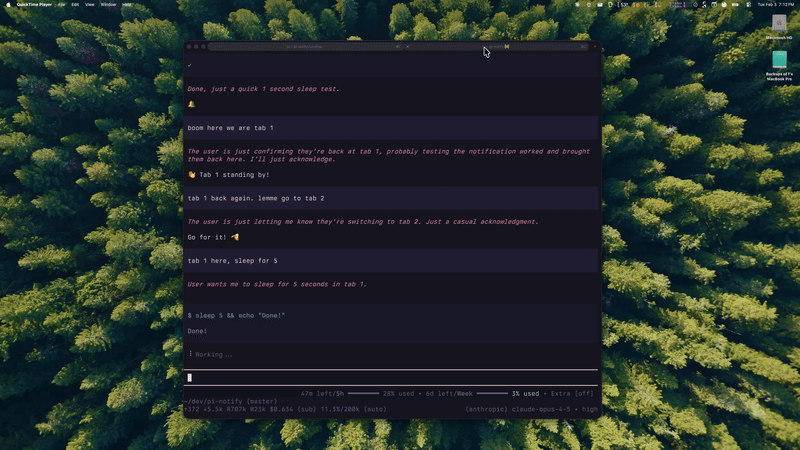

# pi-notify

[简体中文](README.zh-CN.md)

Native desktop notifications when [Pi](https://pi.dev) has finished working and is ready for your next input.



## Highlights

- **Notifies only when Pi is truly settled** — waits until retries, context compaction, and queued follow-ups have finished.
- **Error-aware messages** — distinguishes a normal completion from an unrecoverable agent error.
- **Automatic terminal detection** — selects Windows toast, Kitty OSC 99, iTerm2 OSC 9, or OSC 777 without configuration.
- **tmux support** — wraps OSC notifications in tmux passthrough sequences automatically.
- **Optional sound hook** — runs your command in the background without blocking Pi.
- **Zero runtime dependencies** — one small TypeScript extension.

## Compatibility

| Environment | Notification method |
| --- | --- |
| Windows Terminal | Native Windows toast via PowerShell |
| Kitty | OSC 99 |
| iTerm2 | OSC 9 |
| Ghostty, WezTerm, rxvt-unicode, and compatible terminals | OSC 777 |
| tmux | Automatic DCS passthrough wrapping |

Terminal notification support and notification permissions must be enabled in your terminal and operating system. Windows Terminal notifications require `powershell.exe`; this normally also works from WSL when Windows interop is enabled.

## Install

This maintained copy is currently installed directly from GitHub:

```bash
pi install git:github.com/zheminlin266/pi-notify
```

If the upstream npm package is already installed, remove it first to avoid loading the extension twice:

```bash
pi remove npm:pi-notify
pi install git:github.com/zheminlin266/pi-notify
```

Restart Pi after installation.

## Optional sound

Set `PI_NOTIFY_SOUND_CMD` to any shell command. It is spawned as a detached background process after the desktop notification.

```bash
# macOS
export PI_NOTIFY_SOUND_CMD='afplay /System/Library/Sounds/Glass.aiff'

# Linux
export PI_NOTIFY_SOUND_CMD='paplay /usr/share/sounds/freedesktop/stereo/complete.oga'

# Windows PowerShell
$env:PI_NOTIFY_SOUND_CMD = 'powershell -c "[console]::beep(880,180)"'
```

Add the setting to your shell profile to keep it across sessions. Leave it unset for silent notifications.

## How it works

The extension records the final assistant result on Pi's `agent_end` event, but deliberately waits for `agent_settled` before notifying. This prevents premature notifications during automatic retries, context compaction, or queued follow-up prompts.

At notification time it detects the current terminal from environment variables, emits the appropriate escape sequence or Windows toast, and then starts the optional sound hook.

## Development

Load the local extension while working in this repository:

```bash
pi -e ./index.ts
```

Package metadata is declared under the `pi.extensions` field in [`package.json`](package.json).

## pi.dev availability

Pi can install this repository through Git today. The pi.dev package gallery discovers packages published to npm with the `pi-package` keyword. This maintained copy will need a uniquely named npm release before it can have a separate gallery entry; the unscoped `pi-notify` name belongs to the upstream project.

## Credits

This project is based on [ferologics/pi-notify](https://github.com/ferologics/pi-notify) by [ferologics](https://github.com/ferologics) and retains its MIT license. This repository is an independently maintained copy and is not presented as the original work.

## License

[MIT](LICENSE)
